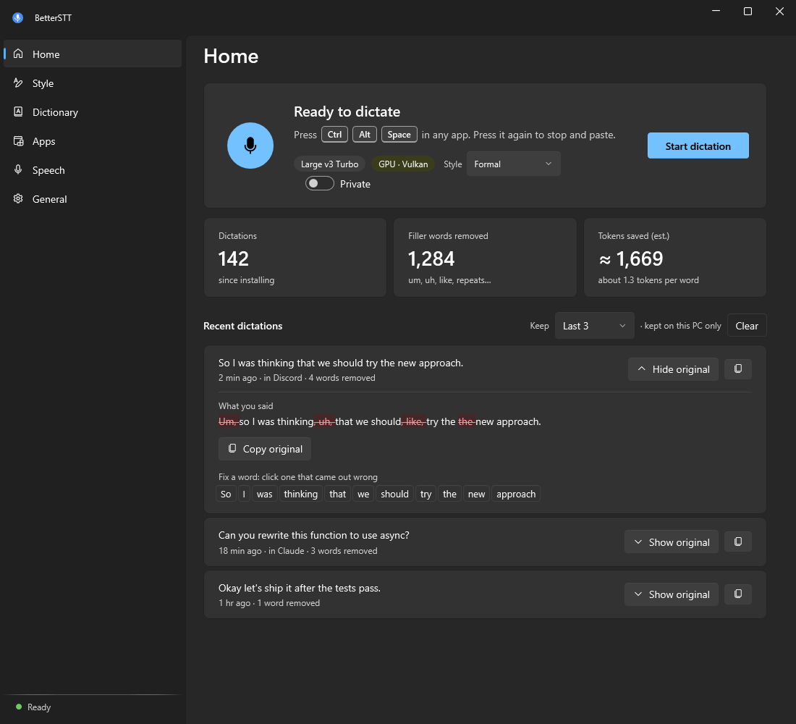
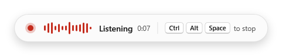
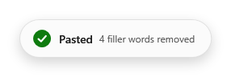
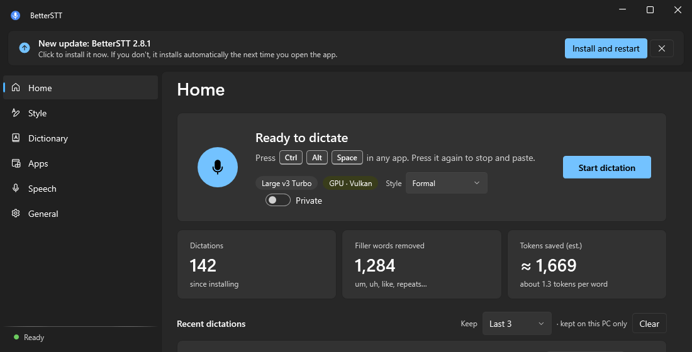
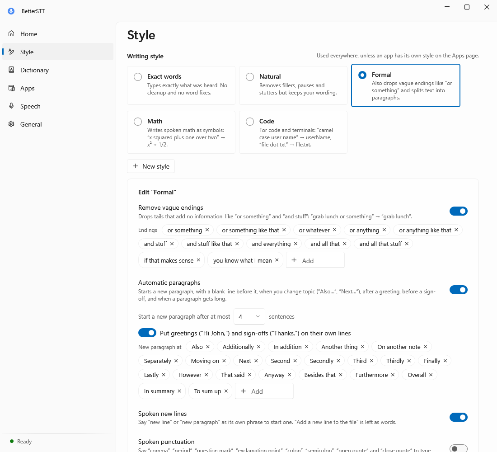
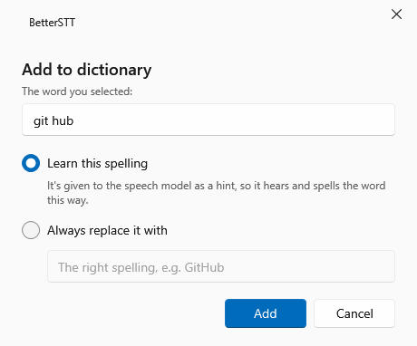
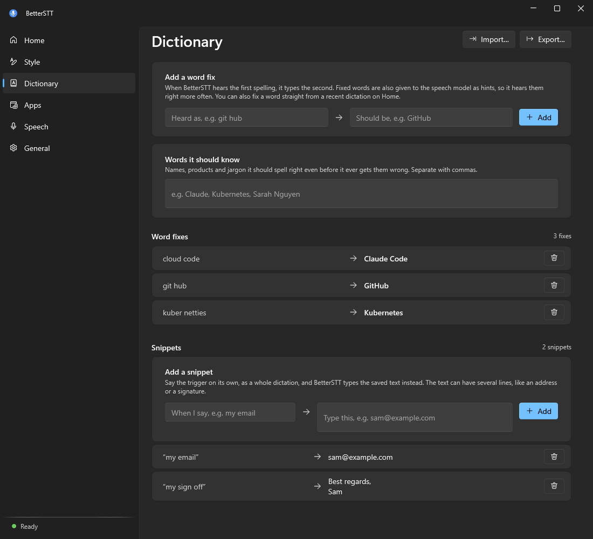
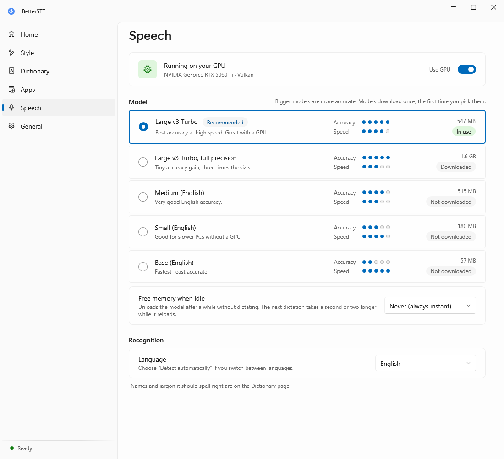

# BetterSTT

BetterSTT is a speech-to-text app for Windows that works in every app on your PC. It removes filler words like "um," "uh" and "like" before your text is typed, so what you send is shorter and cleaner. I made it to save tokens when I dictate into AI chats, and it's just as useful for email, documents and messages.



Press Ctrl + Alt + Space in any app to start listening, and press it again to stop. BetterSTT then types the cleaned text wherever your cursor is. The shortcut works even while the BetterSTT window is open, and if BetterSTT itself is the focused window, the text goes to your clipboard instead.

<p>
  
  
</p>

## Installing BetterSTT

BetterSTT runs on Windows 10 and Windows 11 (64-bit). It doesn't need administrator rights, and it installs only for your own Windows account.

1. Open the [Releases page](../../releases) and download `BetterSTT-Setup-<version>.exe` from the newest release.
2. Run the file you downloaded. The installer isn't code-signed yet, so Windows SmartScreen may show a warning. Click More info, then Run anyway. The [code signing policy](#code-signing-policy) below explains where signing stands.
3. Choose whether BetterSTT should start when you sign in to Windows and whether you want a desktop shortcut, then finish the installer.
4. BetterSTT opens and downloads its speech model the first time it runs. The recommended model is about 550 MB, so the first start takes a few minutes on a normal connection. The status at the bottom left of the window says "Ready" once it's done.
5. Click into any text box, press Ctrl + Alt + Space, speak, and press Ctrl + Alt + Space again.

A graphics card makes transcription much faster, but it isn't required. BetterSTT uses the GPU through Vulkan when one is available and falls back to the processor when it isn't.

### Updating

From version 2.6 on, BetterSTT updates itself. It checks this page once a day and downloads new versions in the background. When an update is ready, a banner at the top of the window offers Install and restart. If you ignore it, the update installs the next time you open BetterSTT. Updates keep your settings, speech models and shortcuts, and they don't bring back a desktop shortcut you deleted. You can turn the daily check off under General.

If you're on a version older than 2.6, download the newest installer and run it once. It upgrades your current copy in place.



### Uninstalling

Uninstall BetterSTT from Settings, Apps in Windows. The uninstaller asks whether to also delete your settings and downloaded speech models.

## What it removes

Every rule can be switched off, and every word list can be edited on the Style page. That page also has a Try it box where you can type something the way you'd say it and see the result.

| Rule | Example |
|---|---|
| Filler sounds | "Um, I think, uh, we should" becomes "I think we should" |
| Pause marks | "I was thinking... maybe" becomes "I was thinking maybe" |
| Verbal fillers, only when they stand alone between commas | "It was, like, huge" becomes "It was huge," while "I like pizza" stays the same |
| Stutters and restarts | "I think I think the the plan" becomes "I think the plan," and "we were go- going" becomes "we were going" |
| Mid-sentence corrections | "Let's meet Tuesday, no wait, Wednesday" becomes "Let's meet Wednesday," and "Buy milk. Scratch that. Buy eggs." becomes "Buy eggs." |
| Notes the model adds | "[BLANK_AUDIO]" and "(music)" are removed |
| Vague endings (Formal style) | "we could grab lunch or something" becomes "we could grab lunch" |

Corrections are worked out from context. A phrase like "no wait" or "scratch that" only signals that you might be correcting yourself, and BetterSTT compares what you said before and after it to decide what to replace. A day replaces a day, a number replaces a number, a repeated word marks where you restarted, and a new clause replaces the old one. When nothing lines up, as in "I'll be late, sorry, traffic is bad," the words are left alone.

BetterSTT uses rules to clean your text and does not use an AI model to rewrite it. It removes what matches a rule and leaves the rest of your wording alone, which means it can't fix a sentence that doesn't make sense.



## Writing styles

A writing style decides how much BetterSTT changes what you said. You can switch styles from the Home page or the tray icon, edit any of them, and create your own.

- Exact words types what you said with no changes at all.
- Natural removes fillers, pauses and stutters and keeps the rest of your wording.
- Formal does everything Natural does, drops vague endings like "or something," and splits longer text into paragraphs. A new paragraph starts when you change topic ("Also," "Next," "Finally"), after a greeting like "Hi Sarah," before a sign-off like "Thanks," and when a paragraph gets long.
- Math writes spoken math as symbols, so "x squared plus one over two" becomes x² + 1/2. It can write LaTeX instead.
- Code is for code editors and terminals. "Camel case user name" becomes userName, with pascal, snake, kebab and constant case too, and "dot," "underscore," "slash," "equals" and brackets become symbols. It only converts what you say and never adds code of its own.

Every style except Exact words also understands "new line" and "new paragraph" when you say them as their own phrase. A style can also turn spoken punctuation into marks, so "comma," "period" and "question mark" type the symbols.

## Making it fit how you work

Word fixes correct words BetterSTT keeps getting wrong. The fastest way to add one is to select the word in any app and press Ctrl + Alt + D, which opens a small window where you can have BetterSTT learn the spelling or always replace it with the right one. If it writes "git hub," click that word in a recent dictation on the Home page and type "GitHub." The fix applies from then on, and the word is also given to the speech model as a hint so it hears it right more often.

Snippets type saved text when you say a trigger phrase on its own. Saying "my email" can type your email address, and a snippet can be several lines long, like a signature.

The Dictionary page can export your word fixes, snippets and vocabulary to a file and import them again, which is useful for a backup or for sharing them with someone else. It also imports a plain list of fixes with one per line, like "git hub, GitHub."

Per-app rules change settings for one app only. Examples are Exact words in a code editor, Formal in Outlook, no extra space in a terminal, typing instead of pasting in apps that block paste, hiding the indicator in games, Spanish in WhatsApp and English everywhere else, or turning line breaks into spaces in a terminal so a multi-line dictation can't run as several commands.





## Reliability

- The shortcut can work as press to start and press to stop, as hold to talk, or as hands-free.
- Hands-free keeps listening with no time limit until you press the shortcut again, then types everything at once. It transcribes quietly at each pause while you talk, so even a long session is typed about a second after you stop.
- The shortcut can be a key combination or a mouse side button.
- Whisper sometimes invents phrases like "Thank you." from a quiet room. BetterSTT checks how much clear speech the recording held and drops those phrases when there wasn't any.
- BetterSTT keeps listening for a moment after you stop, so your last word isn't cut off.
- Esc cancels a dictation without typing anything.
- Each recording is saved to disk while you speak. If the app crashes or transcription fails, the Home page lets you retry it.
- Home keeps your recent dictations so you can copy them again or fix a word. It keeps the last three by default, and you can choose 5, 10, 15 or all of them.
- Ctrl + Alt + Shift + V types your last dictation again, which helps when it went into the wrong window.
- Windows blocks apps from typing into programs that run as administrator. BetterSTT notices this and puts the text on your clipboard so it isn't lost.
- A small indicator shows while you speak, with a live draft of your words. You can move it to any corner or edge of the screen and change its size and opacity.
- When the language is set to detect automatically, each recent dictation shows which language BetterSTT heard.
- The speech model can be unloaded after a set idle time to free memory. It loads again when you start dictating.

## Privacy

Speech recognition runs on your own PC with [Whisper](https://github.com/openai/whisper) through [Whisper.net](https://github.com/sandrohanea/whisper.net). Your audio and text never leave your computer. BetterSTT connects to the internet for two things only, which are the one-time speech model download from Hugging Face and the daily update check on GitHub. Neither request contains anything about you or what you said, and the update check can be turned off. The [privacy policy](PRIVACY.md) has the details.

Your settings, your recent dictations, a log and your speech models are stored in `%LOCALAPPDATA%\BetterSTT`. Private mode, on the Home page or in the tray menu, stops new dictations from being kept in the recent list, and Home has a search box once the list gets longer. Home keeps the last three dictations by default, and you can change that to 5, 10, 15 or all of them. The log records timings and outcomes and never records what you said.



## Command line

- `--toggle`, `--paste-last` and `--cancel` control the copy of BetterSTT that's already running. They work well with launchers, Stream Deck buttons and scripts. If BetterSTT isn't running, it starts in the tray first.
- `--background` starts BetterSTT in the tray without opening its window. The Windows startup entry uses it.
- `--transcribe input.wav result.txt` transcribes a 16 kHz mono WAV file and reports how long it took.
- `--screenshots <folder>` saves every page in light and dark mode as PNG files, using sample data.
- `--no-paste` sends every dictation to the clipboard and never types into a window. It's meant for automated testing.
- `--test-audio file.wav`, together with `--no-paste`, plays a 16 kHz mono WAV file instead of the microphone, so automated tests are repeatable.

## Building from source

Building BetterSTT needs Windows 10 or 11 (64-bit), the [.NET 8 SDK](https://dotnet.microsoft.com/download/dotnet/8.0) and [Inno Setup 6](https://jrsoftware.org/isinfo.php). Run this from the repository folder.

```
powershell -ExecutionPolicy Bypass -File tools\build.ps1
```

The script runs the tests, publishes a self-contained build to `publish\` and writes the installer to `dist\`. Official releases are built by the [Release workflow](.github/workflows/release.yml) on GitHub, and local builds are for testing.

```
src/BetterSTT/           the app (.NET 8, WPF with the WPF-UI Fluent design, lives in the tray)
  DictationController.cs recording, transcription, cleanup, pasting and settings changes
  TextCleaner.cs         the cleanup rules, writing styles and snippets
  SpokenMath.cs          spoken math as symbols or LaTeX
  Transcriber.cs         downloading, loading and running the Whisper model
  AudioRecorder.cs       microphone capture, silence trimming and the level meter
  Native.cs              the global shortcut, typing into other apps and the startup entry
  Updater.cs             update checks, downloads and checksum verification
  Diagnostics.cs         the Save diagnostics file for bug reports
  History.cs             recent dictations, lifetime stats and the word diff
  Tray.cs                the tray icon, its menu and the sounds
  UI/                    the main window pages and the on-screen indicator
tests/BetterSTT.Tests    unit tests for cleanup, styles, snippets, math and updates
installer/               the Inno Setup script
tools/                   the build script and icon generator
.github/workflows/       the release workflow that builds, signs and publishes
.signpath/               the SignPath configuration for signing
docs/screenshots/        the images in this README
```

## Code signing policy

Free code signing provided by [SignPath.io](https://about.signpath.io), certificate by [SignPath Foundation](https://signpath.org).

- Committers and reviewers are [yello-gun](https://github.com/yello-gun).
- Approvers are [yello-gun](https://github.com/yello-gun).

Signed installers are built from this repository by the [Release workflow](.github/workflows/release.yml) on GitHub-hosted runners, and I approve every signing request by hand. Contributions from other people are reviewed before they're merged. Only BetterSTT's own installer is signed, and the open-source libraries it includes are shipped as their projects publish them.

Signing starts with the first release after the SignPath Foundation approves the project. Every installer before that is unsigned.

## License

BetterSTT is released under the [MIT license](LICENSE). It uses Whisper.net and whisper.cpp (MIT), the Whisper model weights from OpenAI (MIT), WPF-UI (MIT) and NAudio (MIT).
