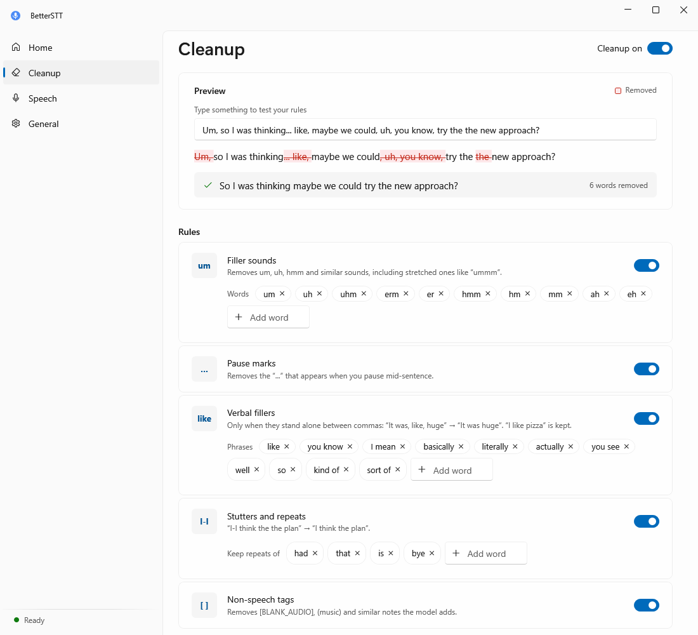

# BetterSTT

System-wide dictation for Windows that removes filler words before your text reaches any app. Say it however it comes out; what gets typed is clean.


Press **Ctrl + Alt + Space** in any app to start listening, and press it again to stop. The cleaned text is pasted wherever your cursor is. The shortcut works at any time, including while the BetterSTT window is open. If BetterSTT itself has focus, the text is copied to the clipboard instead of pasted.

<p>
  
  
</p>

## What gets removed

Every rule can be switched off, and every word list can be edited, on the Cleanup page. It also has a live preview.

| Rule | Example |
|---|---|
| Filler sounds | "Um, I think, uh, we should" → "I think we should" |
| Pause marks | "I was thinking... maybe" → "I was thinking maybe" |
| Verbal fillers (only when they stand alone between commas) | "It was, like, huge" → "It was huge" (but "I like pizza" stays) |
| Stutters and repeats | "I-I think the the plan" → "I think the plan" |
| Non-speech tags | "[BLANK_AUDIO]", "(music)" → removed |



## Private and local

Speech recognition runs **on your PC** with [Whisper](https://github.com/openai/whisper) via [Whisper.net](https://github.com/sandrohanea/whisper.net). It uses the GPU through Vulkan when one is available and falls back to the CPU otherwise. Audio never leaves your computer. The only network access is a one-time download of the speech model you pick, from Hugging Face.


## Install

Download `BetterSTT-Setup-<version>.exe` from [Releases](../../releases) and run it. No admin rights are needed. The installer isn't code-signed yet, so Windows SmartScreen may ask you to confirm (**More info → Run anyway**).

Installing a newer version upgrades in place and keeps your settings and downloaded models.

## Build from source

Requirements: Windows 10/11 x64, the [.NET 8 SDK](https://dotnet.microsoft.com/download/dotnet/8.0) and [Inno Setup 6](https://jrsoftware.org/isinfo.php).

```
powershell -ExecutionPolicy Bypass -File tools\build.ps1
```

This runs the tests, publishes a self-contained build to `publish\`, and writes the installer to `dist\`.

```
src/BetterSTT/           the app (.NET 8, WPF + WPF-UI Fluent design, lives in the tray)
  DictationController.cs the record → transcribe → clean → paste pipeline and settings changes
  TextCleaner.cs         filler-removal rules
  History.cs             last 3 dictations + lifetime stats, and the word diff shown in the UI
  Transcriber.cs         Whisper model download / load / transcribe
  AudioRecorder.cs       mic capture, silence trimming, level meter
  Native.cs              global hotkey, paste/typing into other apps, startup registration
  Tray.cs                tray icon, menu and sounds
  UI/                    main window (Home, Cleanup, Speech, General) and the on-screen pill
tests/BetterSTT.Tests    cleanup-rule and diff unit tests
installer/               Inno Setup script
tools/                   build script, icon generator
docs/screenshots/        images for this README (regenerate with --screenshots)
```

### Command line

- `--background` starts in the tray without opening the window (used by the Windows startup entry).
- `--transcribe input.wav result.txt` transcribes a 16 kHz mono WAV file and reports the runtime and timing.
- `--screenshots <folder>` renders every page in light and dark, plus the on-screen pill, to PNG files. It uses sample data.

## Data

Settings, the last 3 dictations (`history.json`), a log (timings and word counts only, never the dictated text) and downloaded models are stored in `%LOCALAPPDATA%\BetterSTT`. Uninstalling asks whether to delete them.

## License

[MIT](LICENSE). Third-party components: Whisper.net and whisper.cpp (MIT), the Whisper model weights (MIT, OpenAI), WPF-UI (MIT) and NAudio (MIT).
